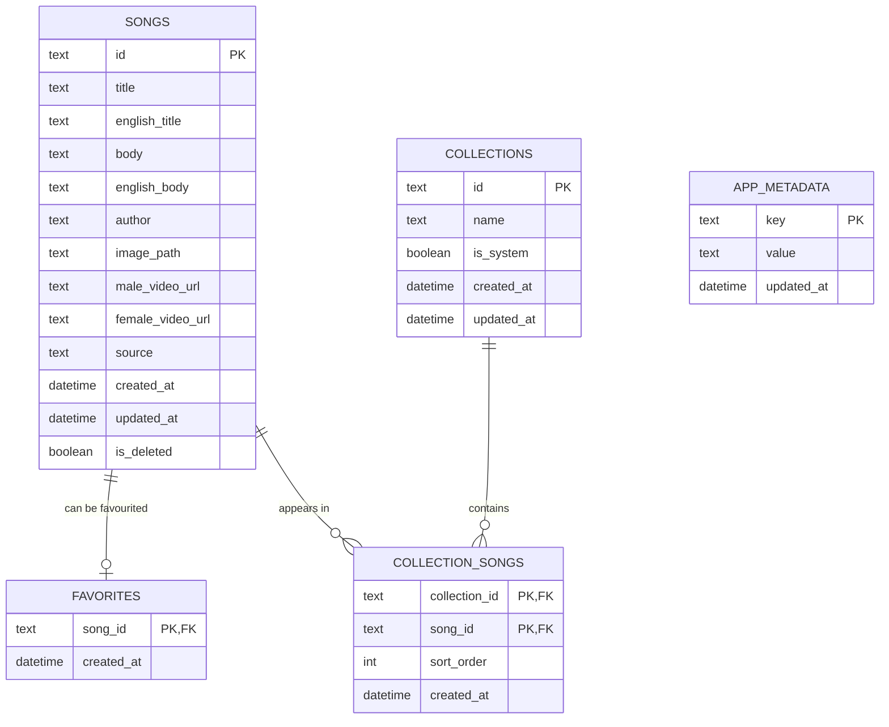

# Praise

Praise is an Android-first, offline-first Flutter application for browsing,
reading, and organizing Christian song lyrics.

The project is currently in the planning and foundation stage. Product scope,
technical boundaries, and the proposed delivery sequence are documented here:

- [Product requirements](docs/PRD.md)
- [Technical architecture](docs/ARCHITECTURE.md)
- [Implementation notes](docs/IMPLEMENTATION_NOTES.md)
- [Canonical lyrics format](docs/LYRICS_FORMAT.md)
- [AppSheet catalogue workflow](docs/APPSHEET_CATALOG_WORKFLOW.md)
- [Chord schema design](docs/CHORDS_SCHEMA.md)
- [Bundled font licenses](docs/FONT_LICENSES.md)
- [OCR components and model provenance](docs/OCR_LICENSES.md)
- [Separate catalogue server setup](docs/CATALOG_SERVER_SETUP.md)
- [Release process and cycles](docs/RELEASE_PROCESS.md)
- [Android release signing setup](docs/RELEASE_SIGNING_SETUP.md)
- [Anonymous GitHub issue relay](support_api/README.md)

## Planned stack

- Flutter and Material 3
- Riverpod
- Drift and SQLite
- Dio
- GoRouter
- Freezed and json_serializable

## Current state

The offline library seeds all 1,374 normalized songs and supports local search,
favorites, custom-song CRUD, automatic My Songs membership, user-defined list
management, song ordering, persistent reading preferences, formatted repeat
cues, text/image/PDF sharing for songs and lists, importable list links,
full-lyrics list exports,
offline Telugu-English photo scanning with optional Gemini Nano organization or
private original-photo storage when OCR is unreliable,
automatic English-title transliteration for custom songs, pinch-to-resize lyrics, and
five persistent Telugu typeface choices (system plus four bundled Google Fonts
families). A versioned GitHub Pages catalogue provides manual snapshot
synchronization without a maintained application server.
An optional stateless Render relay lets users submit public GitHub song requests
and reports without a GitHub account, returning a tracking link to the app.

## Local data model

Praise stores app data in a local Drift/SQLite database. Server catalogue rows
and user-created rows share the `songs` table, separated by the `source` field.
Catalogue refreshes may update only `source = server` rows; custom songs,
favourites, lists, and settings remain local user data.



## Database optimisation

Current optimisation is intentionally simple and local-first:

- SQLite primary keys index `songs.id`, `collections.id`, `favorites.song_id`,
  `app_metadata.key`, and the composite
  `collection_songs(collection_id, song_id)`.
- Foreign keys are enabled before opening the database, so deleting songs or
  lists cleans up dependent rows.
- The app creates secondary indexes for active song ordering, server refresh
  filters, and ordered collection detail:
  `songs_active_title_idx`, `songs_source_deleted_idx`, and
  `collection_songs_order_idx`.
- Seed import, catalogue refresh, and list reorder operations run inside
  transactions.
- The UI reads from Drift streams, so screens update from local cached data
  without remote round trips.
- Song and list screens use lazy list rendering.

The explicit indexes are:

```sql
CREATE INDEX songs_active_title_idx
ON songs (is_deleted, title);

CREATE INDEX songs_source_deleted_idx
ON songs (source, is_deleted);

CREATE INDEX collection_songs_order_idx
ON collection_songs (collection_id, sort_order);
```

For the current 1,374-song catalogue, the simple `LIKE` search over local SQLite
is acceptable. If search needs to scale beyond title/author matching, move to
SQLite FTS rather than adding many ad hoc `LIKE` indexes.

## Baseline commands

```powershell
flutter pub get
flutter analyze
flutter test
flutter run
```

For wireless Android development from Git Bash or WSL, use:

```bash
scripts/run_wireless_flutter.sh
scripts/run_wireless_flutter.sh --hotreload
scripts/run_wireless_flutter.sh --prod
scripts/run_wireless_flutter.sh --mode release
```

The script lists wireless ADB devices, connects to the selected `HOST:PORT`,
and starts `flutter run`. Debug mode supports hot reload from the terminal.

Normal builds use the production catalogue automatically:

```powershell
flutter run
```

Override the catalogue only for development or staging:

```powershell
flutter run --dart-define=CATALOG_MANIFEST_URL=https://example.test/catalog/manifest.json
```

Catalogue publishing is intentionally separated from the application
repository. After the one-time GitHub configuration, every push to `main`
validates and synchronizes the static catalogue to its dedicated GitHub Pages
repository. See [Separate catalogue server setup](docs/CATALOG_SERVER_SETUP.md).
