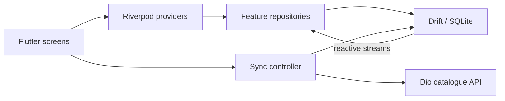
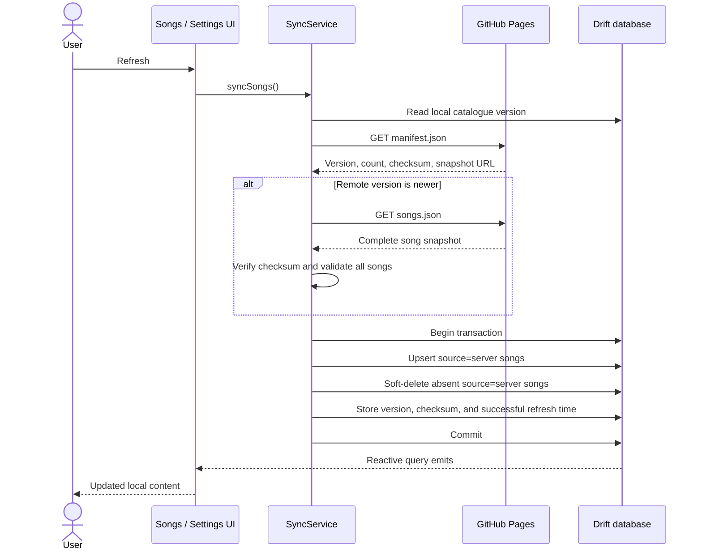

# Praise — Technical Architecture

## 1. Architecture overview

Praise uses an offline-first, feature-oriented Flutter architecture. The local
Drift/SQLite database is the application source of truth. Remote API responses
are never rendered directly; synchronization writes validated changes to the
database, and reactive queries update the UI.



## 2. Technology choices

| Concern | Choice | Reason |
| --- | --- | --- |
| UI | Flutter and Material 3 | Android-first with portable UI code |
| State and dependency injection | Riverpod | Testable providers and reactive composition |
| Persistence | Drift with SQLite | Typed queries, transactions, migrations, and streams |
| HTTP | Dio | Configurable client, timeouts, and structured failures |
| Navigation | GoRouter | Declarative routes and nested bottom navigation |
| Immutable API models | Freezed and json_serializable | Validated serialization with generated value types |
| Identifiers | UUID | Collision-resistant IDs for locally created records |

Dependencies should be added only when they remove meaningful complexity.

## 3. Architectural boundaries

The application is organized by feature, with shared infrastructure under
`core` and application composition under `app`.

```text
lib/
├── app/
│   ├── app.dart
│   ├── router.dart
│   └── theme/
├── core/
│   ├── config/
│   ├── database/
│   ├── errors/
│   ├── network/
│   └── sync/
├── features/
│   ├── songs/
│   │   ├── data/
│   │   ├── domain/
│   │   └── presentation/
│   ├── favorites/
│   ├── collections/
│   ├── custom_songs/
│   └── settings/
├── shared/
│   └── presentation/
└── main.dart
```

Each feature may use only the layers it needs. V1 should not add empty
interfaces or mapping layers solely to mirror a theoretical architecture.

### Presentation

- Contains screens, widgets, controllers, and UI-facing providers.
- Observes repository streams and invokes repository or service operations.
- Does not access Drift tables, SQL, or Dio directly.

### Domain

- Contains application-level models or repository contracts when a meaningful
  boundary is needed.
- Remains independent of Flutter widgets and HTTP response formats.
- May be omitted for simple feature-local values when it would add no clarity.

### Data

- Implements repositories using Drift and, for sync, the remote data source.
- Owns persistence queries, entity mapping, and remote DTO conversion.
- Converts infrastructure exceptions to the application's typed failures.

## 4. Data ownership

| Data | Owner | Server refresh may change it? |
| --- | --- | --- |
| Server songs | Catalogue server | Yes |
| Custom songs | Local user | No |
| Favourites | Local user | No, except orphan cleanup |
| Lists | Local user | No |
| List membership and order | Local user | No, except orphan cleanup |
| Theme, font size, and Telugu typeface | Local user | No |
| Last catalogue sync time | Sync service | Only after successful sync |

The `source` field on a song is the critical ownership boundary. Sync queries
must explicitly restrict updates and deletions to `source = server`.

## 5. Database design

### 5.1 Tables

#### `songs`

| Column | Type | Notes |
| --- | --- | --- |
| `id` | text, primary key | Server ID or locally generated UUID |
| `title` | text | Required primary-language title |
| `english_title` | text, nullable | Optional English title |
| `body` | text | Required primary-language body; preserves line breaks |
| `english_body` | text, nullable | Optional English body; preserves line breaks |
| `author` | text, nullable | Optional author or source attribution |
| `source` | text | `server` or `custom` |
| `created_at` | datetime | Stored in UTC |
| `updated_at` | datetime | Stored in UTC |
| `is_deleted` | boolean | Supports server soft deletion if selected |

#### `favorites`

| Column | Type | Notes |
| --- | --- | --- |
| `song_id` | text, primary/foreign key | One favourite per song |
| `created_at` | datetime | Stored in UTC |

#### `collections`

| Column | Type | Notes |
| --- | --- | --- |
| `id` | text, primary key | Locally generated UUID |
| `name` | text | Trimmed and non-empty |
| `created_at` | datetime | Stored in UTC |
| `updated_at` | datetime | Stored in UTC |

#### `collection_songs`

| Column | Type | Notes |
| --- | --- | --- |
| `collection_id` | text, foreign key | Cascades with collection deletion |
| `song_id` | text, foreign key | Prevents missing song references |
| `sort_order` | integer | Dense ordering within a collection |
| `created_at` | datetime | Stored in UTC |

The composite primary key is (`collection_id`, `song_id`), preventing duplicate
membership.

#### `sync_metadata`

| Column | Type | Notes |
| --- | --- | --- |
| `key` | text, primary key | For example `last_song_sync` |
| `value` | text | ISO-8601 timestamps or simple metadata values |
| `updated_at` | datetime | Stored in UTC |

#### `settings`

A small key/value table is sufficient for V1 preferences if a dedicated
settings store is not used. It supports theme mode, lyrics font size, and the
selected Telugu typeface family.

### 5.2 Indexing

Add indexes after measuring generated queries, starting with:

- song title;
- English title and author;
- source and deletion state;
- server `updated_at`; and
- collection ID plus sort order.

For a moderate catalogue, normalized lowercase title columns or SQLite `LIKE`
queries are sufficient. Full-text search is intentionally deferred.

### 5.3 Migrations

- Increment `schemaVersion` for every schema change.
- Preserve user-owned rows during migrations.
- Add migration tests before shipping an upgrade.
- Never solve a migration problem by deleting the production database.

## 6. Repository contracts

Suggested responsibilities:

### `SongRepository`

- watch active songs with an optional local search query;
- watch or fetch a song by ID;
- create, update, and delete custom songs;
- seed the bundled catalogue if required; and
- provide database operations required by the sync service.

### `FavoritesRepository`

- watch favourite songs;
- watch whether a song is a favourite; and
- toggle or explicitly set favourite state.

### `CollectionsRepository`

- watch lists and list details;
- create, rename, and delete lists;
- add and remove songs; and
- reorder list membership transactionally.

### `SettingsRepository`

- watch and set theme mode;
- watch and set lyrics font size;
- watch and set the Telugu typeface; and
- expose the last successful sync timestamp.

Repository interfaces are useful where tests or alternate implementations need
a boundary. Avoid creating separate interfaces that merely repeat generated
Drift methods without simplifying consumers.

## 7. Provider design

Riverpod provides composition and state lifecycles:

- singleton providers: database, Dio, repositories, and sync service;
- stream providers: song lists, song detail, favourites, lists, and settings;
- simple state provider or notifier: debounced search query and active filters;
- async notifier/controller: manual sync state and custom-song form submission.

Database stream providers should be the only source used to render persistent
data. A successful command does not need to manually patch a song list if the
underlying Drift stream will emit the new state.

## 8. Static catalogue

V1 uses GitHub Pages as immutable static storage rather than an application
server. The static files are hosted in a repository separate from the Flutter
application. A workflow in the application repository validates the catalogue
and pushes `docs/catalog/` to the server repository whenever `main` is updated.
The server repository publishes its `main` branch root through GitHub Pages.
The manifest URL is supplied with:

```text
https://nani-samireddy.github.io/praise-catalog/catalog/manifest.json
```

This production URL is the default application configuration. A
`CATALOG_MANIFEST_URL` compile-time definition may override it for development
or staging builds.

`manifest.json` contains the schema version, monotonically increasing catalogue
version, generation timestamp, song count, SHA-256 checksum, and a relative URL
to `songs.json`. The application downloads the large snapshot only when the
remote version exceeds the locally stored version.

The complete snapshot is decoded as UTF-8, checksum-verified, shape-validated,
counted, and checked for duplicate IDs before a database transaction begins.
No API key, user account, server process, or remote database exists in V1.
Cross-repository publishing uses a write-enabled deploy key scoped only to the
catalogue server repository. The private key is stored as an Actions secret in
the application repository and is never included in an app build.

## 9. Synchronization algorithm



Required invariants:

1. Custom rows are never targets of server upsert or deletion.
2. Catalogue metadata changes in the same successful transaction as catalogue
   data. An already-current manifest records a successful check without a
   snapshot download.
3. An invalid response produces zero database changes.
4. Only one catalogue synchronization runs at a time.
5. UI content remains backed by local streams during network activity.
6. Dio errors do not escape directly into presentation code.

## 10. Initial seeding

At startup, a bootstrap service checks a durable seed marker in
`sync_metadata`. If absent, it parses the bundled JSON and inserts the songs and
marker in one transaction.

Bundled imports upsert only their known server songs. They never delete other
server songs and skip IDs already owned by custom songs, protecting data after
application upgrades or remote synchronization.

The marker is preferable to checking whether `songs` is empty because a user
could legitimately reach an empty active catalogue later. Seed parsing failure
must surface as an initialization error and must not write the marker.

## 11. Navigation architecture

Use `StatefulShellRoute.indexedStack` for the four primary branches so each tab
retains its navigation and scroll state. Song detail and list detail may be
nested in their corresponding branch. The custom-song editor may be a top-level
route displayed above the navigation shell.

Route parameters contain IDs only. Screens resolve current entities from local
repositories so deep links and database updates behave consistently.

## 12. Failure model

Infrastructure exceptions are mapped to typed application failures:

- `NetworkFailure`: connection, timeout, or unreachable service;
- `InvalidResponseFailure`: response shape or value validation failed;
- `DatabaseFailure`: local query, constraint, or transaction failed; and
- `SyncFailure`: higher-level synchronization failure with an appropriate
  user-facing description and optional cause.

Presentation code maps failures to short messages and retry actions. Detailed
causes may be logged in debug builds but should not be displayed raw to users.

## 13. Concurrency and transactions

- Serialize manual sync requests to prevent overlapping catalogue writes.
- Use transactions for seed import, sync application, list reordering, and
  multi-table deletes.
- Let Drift serialize ordinary single-row writes.
- Treat delete-versus-edit races for custom songs as local UI concerns; a form
  should report when its target no longer exists.

## 14. Testing architecture

### Unit and repository tests

Use an in-memory Drift database for:

- seeding once;
- local title search;
- favourites persistence behavior;
- custom song CRUD;
- list CRUD, membership, and ordering; and
- server sync insert, update, delete, preservation, and rollback behavior.

### Provider and service tests

Override repositories and HTTP clients to verify loading, success, and failure
states without network access.

### Widget tests

Cover the core cached-data path, search, empty states, favourite action, lyric
font scaling, and non-blocking refresh feedback.

### Integration tests

Before release, validate first launch, restart persistence, airplane-mode use,
and a complete refresh on an Android emulator or device.

## 15. Observability

V1 may use structured debug logging around bootstrap and sync boundaries. Log
operation names, counts, durations, and error categories—not complete lyrics.
Analytics and crash reporting are not required for the initial implementation.

## 16. Architecture decisions to record later

Create lightweight ADRs if the team changes any of these decisions:

- database remains the UI source of truth;
- manual rather than background synchronization;
- soft versus hard deletion of server songs;
- settings persistence mechanism;
- normalized search columns or full-text search; and
- user data cloud-sync strategy.

## 17. V2 shareable-list boundary

Shareable lists should extend the local collections feature through explicit
export and import services. They must not reuse the read-only catalogue update
channel or introduce a writable GitHub repository.

The transport is a versioned, size-limited Praise list package passed through
the operating-system share and file-opening mechanisms. The package contains
list metadata and stable catalogue song identifiers. Import always creates new
local identifiers, validates the complete package before writing, and performs
the accepted import in one database transaction.

Custom-song payloads require a product decision before the schema is finalized.
If included, their lyrics must be clearly disclosed in the preview and require
explicit confirmation before sharing. Unknown fields may be ignored for forward
compatibility, while unsupported major schema versions must be rejected.

This boundary provides asynchronous device-to-device sharing with no account,
backend, or cloud ownership model. Live collaborative editing and synchronized
shared lists require a separate architecture decision.
