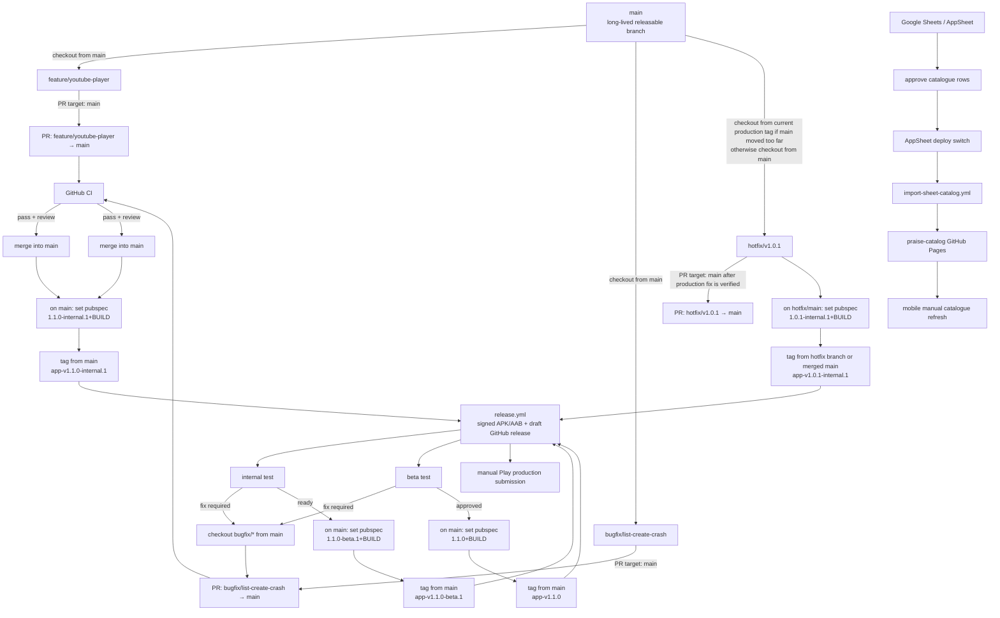

# Praise Release Process

## 1. Purpose

Praise has two independently versioned products:

1. The Flutter application, identified by `com.nanisamireddy.praise`.
2. The static song catalogue published from the app repository to
   `nani-samireddy/praise-catalog`.

A catalogue correction should not require a new APK. An application release
may include a newer bundled catalogue, but it does not have to wait for the next
catalogue-only publication.

## 2. Release types

### Catalogue release

Use for lyric corrections, spacing fixes, metadata updates, additions, and
removals that do not change the application code or catalogue schema.

- Increment `catalogVersion` by at least one.
- Keep the original supplied source file unchanged.
- Regenerate the normalized source, review report, app bundle, manifest, and
  published snapshot.
- Validate all generated files before committing.
- Push to the app repository's `main` branch. The publishing workflow updates
  the separate GitHub Pages repository automatically.

Target cadence: publish reviewed corrections weekly or when a meaningful batch
is ready. Do not create empty releases to satisfy a calendar.

### Application patch release

Use for backward-compatible bug fixes, accessibility corrections, dependency
security updates, and small UI fixes. Examples: `1.0.1`, `1.0.2`.

Target cadence: as needed, normally no more than once every two to four weeks.

### Application minor release

Use for meaningful backward-compatible capabilities. Examples: `1.1.0`,
`1.2.0`. V2 features begin with `2.0.0` rather than being folded into V1 minor
releases.

Target cadence: every six to twelve weeks when a complete, tested group of
features is ready.

### Hotfix release

Use only for crashes, data loss, broken startup, unusable catalogue refresh,
critical privacy/security problems, or a release-blocking content issue.

- Stop the active rollout when possible.
- Fix the smallest safe surface.
- Increment the patch and build numbers.
- Run the complete automated suite and focused physical-device regression.
- Publish a new build. Never attempt to replace a previously uploaded build
  number.

## 3. Versioning

Application versions use Flutter's `MAJOR.MINOR.PATCH+BUILD` format for stable
builds and `MAJOR.MINOR.PATCH-STAGE.N+BUILD` for internal/beta builds in
`pubspec.yaml`:

```yaml
version: 1.0.0+1
version: 1.0.0-internal.1+2
version: 1.0.0-beta.1+3
```

- `MAJOR`: incompatible product or data-contract change.
- `MINOR`: backward-compatible feature group.
- `PATCH`: backward-compatible correction.
- `BUILD`: monotonically increasing positive integer used as Android
  `versionCode`.

Supported application stages are `internal`, `beta`, and stable. Every uploaded
Android build receives a build number higher than all previous uploads,
including rejected and internal-test builds.

The catalogue uses its own monotonically increasing integer
`catalogVersion`. Never lower or reuse a published catalogue version. To undo a
bad catalogue, publish the corrected previous content under a new, higher
version.

## 4. Branch and commit policy

- `main` is always expected to build and remain releasable.
- Use short-lived branches for changes that require review.
- Rebase or merge only after automated checks pass.
- Keep catalogue generation and application behavior changes in separate
  commits when practical.
- Do not commit keystores, passwords, private keys, Play credentials, or local
  `key.properties` files.
- Tag internal application builds as `app-vMAJOR.MINOR.PATCH-internal.N`, for
  example `app-v1.0.0-internal.1`.
- Tag beta application builds as `app-vMAJOR.MINOR.PATCH-beta.N`, for example
  `app-v1.0.0-beta.1`.
- Tag stable application releases as `app-vMAJOR.MINOR.PATCH`, for example
  `app-v1.0.0`.

### Branching and release workflow

Use `main` as the only long-lived app branch. All normal app code changes branch
from `main` and open PRs back to `main`. Release tags are created from `main`
after the relevant staged version is committed.

Catalogue-only updates do not use app feature branches. They flow through
AppSheet and the catalogue import workflow.



#### Normal feature branch

Use this for app behavior changes, UI changes, sync changes, YouTube work,
sharing/export changes, and database changes.

Checkout from:

```text
main
```

Branch name:

```text
feature/<short-name>
```

PR target:

```text
main
```

Example:

```powershell
git checkout main
git pull
git checkout -b feature/youtube-player-polish

# make changes

git add .
git commit -m "Polish YouTube practice player"
git push -u origin feature/youtube-player-polish
```

Open PR:

```text
feature/youtube-player-polish → main
```

After CI passes, merge to `main`. Do not tag from the feature branch.

#### Normal bugfix branch

Use this for non-production-blocking bugs.

Checkout from:

```text
main
```

Branch name:

```text
bugfix/<short-name>
```

PR target:

```text
main
```

Example:

```powershell
git checkout main
git pull
git checkout -b bugfix/list-create-disposed-controller

# make fix

git add .
git commit -m "Fix list creation controller lifecycle"
git push -u origin bugfix/list-create-disposed-controller
```

Open PR:

```text
bugfix/list-create-disposed-controller → main
```

#### Hotfix branch

Use this only when the current production app has a serious issue.

Default checkout source:

```text
main
```

If `main` already contains unreleased risky changes, checkout from the latest
stable production tag instead:

```powershell
git checkout app-v1.0.0
git checkout -b hotfix/v1.0.1
```

PR target after verification:

```text
main
```

Hotfix rule:

```text
fix only the production blocker
```

Do not include feature cleanup, refactors, or catalogue-only changes.

#### Internal, beta, and stable tags

Tags are created only after the version is committed.

Internal build:

```powershell
git checkout main
git pull

# edit pubspec.yaml
# version: 1.1.0-internal.1+10

git add pubspec.yaml
git commit -m "Prepare internal release 1.1.0-internal.1"
git tag app-v1.1.0-internal.1
git push origin main
git push origin app-v1.1.0-internal.1
```

Beta build:

```powershell
git checkout main
git pull

# edit pubspec.yaml
# version: 1.1.0-beta.1+11

git add pubspec.yaml
git commit -m "Prepare beta release 1.1.0-beta.1"
git tag app-v1.1.0-beta.1
git push origin main
git push origin app-v1.1.0-beta.1
```

Stable build:

```powershell
git checkout main
git pull

# edit pubspec.yaml
# version: 1.1.0+12

git add pubspec.yaml
git commit -m "Prepare stable release 1.1.0"
git tag app-v1.1.0
git push origin main
git push origin app-v1.1.0
```

#### Catalogue-only update

Use this for lyric text, spacing, author/source, YouTube URL, add song, or
remove song changes that do not require app code changes.

Do not create an app release branch.

Flow:

```text
AppSheet → approve rows → deploy switch → import-sheet-catalog.yml → main commit → praise-catalog
```

The catalogue workflow commits generated catalogue files back to `main` and
publishes `manifest.json`, `songs.json`, and delta files to the separate
catalogue repository.

#### Examples

| Change | Branch | Version/tag path | Notes |
| --- | --- | --- | --- |
| Add YouTube player improvements | checkout from `main`, PR `feature/youtube-player` → `main` | `app-v1.1.0-internal.1` → `app-v1.1.0-beta.1` → `app-v1.1.0` | Feature release; test through internal and beta. |
| Fix list creation crash before launch | checkout from `main`, PR `bugfix/list-create-crash` → `main` | Usually next internal/beta build | Merge through PR unless it blocks production. |
| Fix production crash in `1.0.0` | checkout from `app-v1.0.0` if `main` is risky; otherwise `main`; PR `hotfix/v1.0.1` → `main` | `app-v1.0.1-internal.1` → `app-v1.0.1` | No unrelated cleanup or features. |
| Correct one lyric line | AppSheet row update | `catalogVersion` only | No app tag or APK release. |

## 5. Standard application release cycle

### Stage A — Plan

1. Select the issues included in the release.
2. Identify database, catalogue schema, dependency, and permission risks.
3. Define acceptance checks for every included change.
4. Confirm that deferred work is explicitly excluded.

### Stage B — Implement continuously

1. Keep changes small and independently testable.
2. Add or update automated tests with behavior changes.
3. Keep `main` green and avoid long-lived release branches.
4. Run catalogue validation whenever generated data changes.

### Stage C — Freeze the next staged build

1. Stop adding features to the staged build.
2. Update `pubspec.yaml` version and build number.
3. Update release notes and catalogue version references.
4. Build a signed release AAB and a signed tester APK from the same commit.
5. Record artifact SHA-256 checksums.

### Stage D — Verify

Run the automated gate:

```powershell
flutter pub get
dart format --output=none --set-exit-if-changed lib test
flutter analyze
flutter test
python tool/validate_catalog.py
flutter build apk --release
Push-Location android
.\gradlew.bat :app:bundleRelease
Pop-Location
python tool/verify_android_artifacts.py `
  --apk build\app\outputs\flutter-apk\app-release.apk `
  --aab build\app\outputs\bundle\release\app-release.aab
```

Run the physical-device gate on the Pixel:

- clean installation and first catalogue seed;
- upgrade from the most recent production build;
- app restart and persisted settings;
- airplane-mode browse, search, favourites, lists, and custom songs;
- catalogue refresh from GitHub Pages;
- Telugu font selection and restart persistence;
- pinch resizing, formatted labels, repeat expansion, copy, and share;
- light, dark, high-text-scale, and narrow-layout checks;
- removal or recovery of interrupted catalogue downloads; and
- confirmation that no custom songs or local lists are changed by refresh.

### Stage E — Distribute internal or beta build

1. Upload the AAB to the Google Play internal-test track.
2. Install the tester build through Play, not only through ADB.
3. Allow at least 24 hours for normal V1 beta builds unless the change is an
   urgent hotfix.
4. Record discovered problems against the exact stage and build number.
5. Produce a new internal or beta build for every correction.

Google Play account-specific testing requirements must be treated as a release
gate when shown in Play Console.

### Stage F — Release

1. Confirm the exact commit, version, build number, signing certificate, and
   release notes.
2. Create and push the final `app-vMAJOR.MINOR.PATCH` tag.
3. Create a GitHub release containing release notes, checksums, and the signed
   tester APK when direct distribution is intended.
4. Publish the AAB to production.
5. The first production release goes through Play review without a staged
   percentage rollout. For later updates, start with a limited staged rollout
   when the audience is large enough to provide useful signals.

Suggested update rollout:

| Observation window | Audience |
| --- | ---: |
| First 24 hours | 10% |
| Next 24 hours | 25% |
| Next 24 hours | 50% |
| After clean observation | 100% |

Small audiences may move directly from internal testing to 100% production
because percentages would not provide meaningful evidence.

### Stage G — Observe and close

For at least 48 hours after production:

- monitor Play crashes and Android vitals;
- review catalogue-refresh failures and user reports;
- verify the live manifest and snapshot checksum;
- halt a staged rollout if a material regression appears;
- record follow-up work without silently expanding the released scope; and
- mark the release complete only after artifacts and notes are recoverable.

## 6. Catalogue-only release cycle

1. Edit the maintained source and explicit correction files.
2. Run normalization and inspect all review warnings.
3. Increment the catalogue version.
4. Build the app bundle and static server snapshot.
5. Run `python tool/validate_catalog.py`.
6. Review the generated diff for unexpected large-scale wording changes.
7. Commit and push to app `main`.
8. Confirm the cross-repository Actions workflow succeeds.
9. Verify the live manifest version, song count, snapshot size, and SHA-256.
10. Refresh a physical device and confirm local user data remains unchanged.

Catalogue rollback means republishing known-good content under a new higher
catalogue version. Rewriting GitHub history or lowering `catalogVersion` is not
a supported recovery path.

## 7. Signing and secret policy

- Use Google Play App Signing for Play distribution.
- Keep a dedicated upload key separate from Google's app-signing key.
- Store the upload keystore and credentials in at least two encrypted,
  access-controlled backup locations.
- Keep one backup offline.
- Never generate the only copy of a signing key inside ephemeral CI.
- Store CI credentials as GitHub Actions secrets and restrict environment
  approval for production publishing.
- Rotate the upload key through Play Console if it is lost or compromised.
- Record certificate SHA-256 fingerprints in a private release record.

The catalogue deploy key is independent from Android signing and must never be
reused for application release signing.

## 8. GitHub automation roadmap

### Existing

- `publish-catalog.yml` validates and synchronizes the static catalogue from
  app `main` to `praise-catalog`.
- `ci.yml` validates formatting, analysis, tests, catalogue integrity, and an
  Android debug build for pull requests and `main`.
- `release.yml` validates version tags, builds signed APK/AAB artifacts, stores
  the AAB as a protected Actions artifact, and creates a draft GitHub release
  containing the APK and checksums.

### Release workflow configuration

Configure the four signing secrets documented in
`docs/RELEASE_SIGNING_SETUP.md` before pushing a version tag. Create a GitHub
Actions environment named `production` for the release job.

Production Play submission remains manually approved for V1. Fully automatic
production rollout is intentionally deferred until multiple releases prove the
pipeline reliable.

## 9. V1.0.0 release gates

The first public release cannot proceed until all are complete:

- [x] Final application ID: `com.nanisamireddy.praise`.
- [x] Separate public GitHub Pages catalogue with automatic publication.
- [x] Production catalogue URL configured in the application.
- [ ] Final launcher icon and launch branding.
- [ ] Android signing keystore generated, backed up, and configured.
- [x] Release AAB and APK signed and verified.
- [ ] Thirty repeat-marker review items resolved or explicitly accepted.
- [ ] Lyrics publication rights and attribution decision recorded.
- [ ] Full Pixel beta/stable checklist passed.
- [ ] Store listing, privacy statement, screenshots, and release notes ready.
- [ ] GitHub `app-v1.0.0` release and Play production submission completed.

## 10. Decision ownership

For V1, the maintainer approves:

- final catalogue content and publication rights;
- signing-key custody;
- release scope and version;
- exceptions to the QA gates; and
- production rollout or rollback.

No release is forced by cadence. Quality gates take precedence over target
dates.
